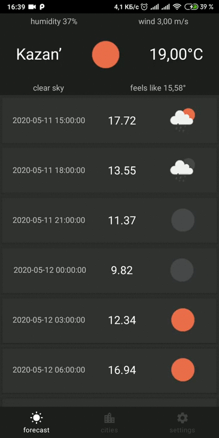

# WeatherApp

## Api
[OpenWeatherMap](https://openweathermap.org/api)

## Stack
* Clean Arch
* Kotlin
* MVVM
* Arch Components (Navigation, LiveData, Room)
* Coroutines
* Koin
* Retrofit
* Glide

## UI

